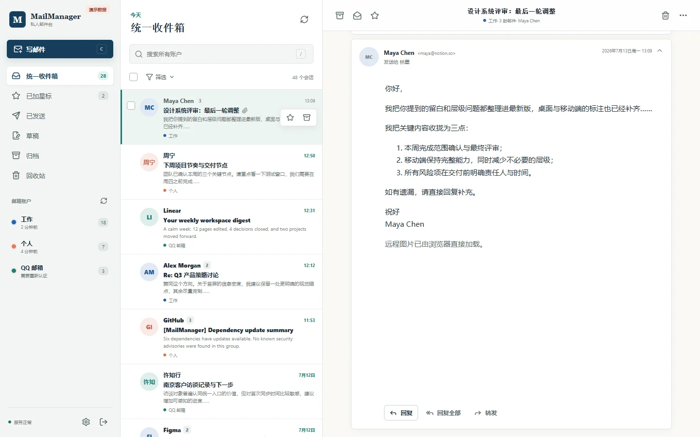
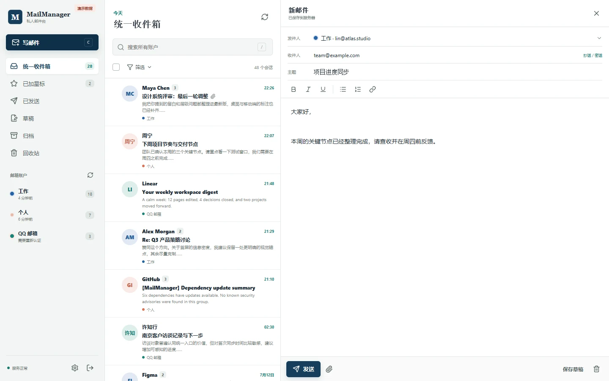
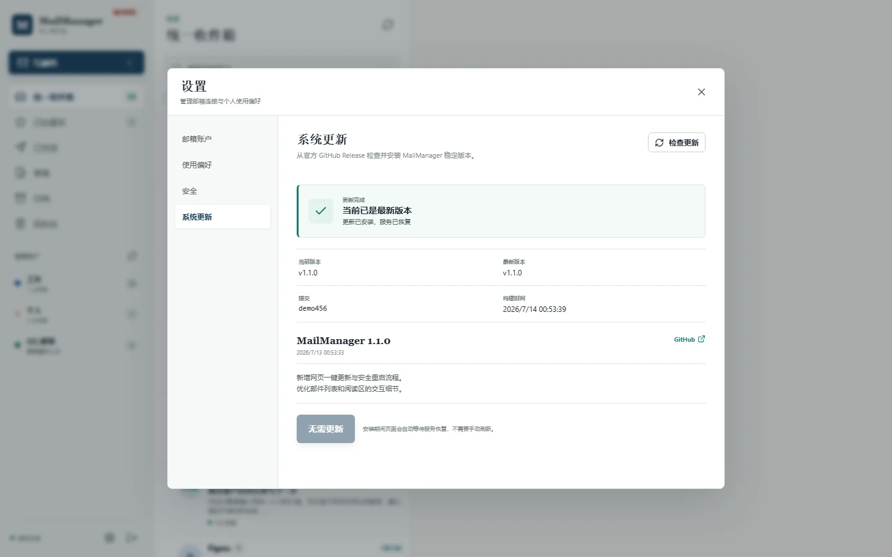

<p align="center">
  
</p>

<h1 align="center">MailManager</h1>

<p align="center">
  <strong>把分散在不同服务商的邮箱，收进一个安静、清晰的私人邮件工作台。</strong>
</p>

<p align="center">
  
  
  
  
  
</p>

<p align="center">
  <a href="#快速部署">快速部署</a>
  ·
  <a href="#功能特性">功能特性</a>
  ·
  <a href="#支持的邮箱">支持的邮箱</a>
  ·
  <a href="#产品截图">产品截图</a>
  ·
  <a href="#自动更新">自动更新</a>
  ·
  <a href="#常见问题">常见问题</a>
</p>

---

<p align="center">
  
</p>

MailManager 是一个适合长期运行在私人 Linux 服务器上的多邮箱 Web 客户端。它把 Gmail、Outlook、QQ、163 和其他 IMAP/SMTP 邮箱放到同一个界面中，让你在一个收件箱里阅读、搜索、回复、写信和整理邮件。

前端、后台同步和管理页面都包含在同一个二进制中。服务器只需要运行一个 systemd 服务，日常更新也可以直接在网页中完成。

## 功能特性

| 统一管理 | 阅读与整理 | 写信与草稿 |
| --- | --- | --- |
| 多账户统一收件箱，并保留清晰的账户归属 | 会话阅读、全文搜索、星标、归档、回收站与批量操作 | 内联写信、回复、回复全部、转发、附件和自动保存草稿 |

| 安全访问 | 响应式界面 | 网页更新 |
| --- | --- | --- |
| 管理员密码、TOTP、恢复码、受保护的凭据与严格同源校验 | 桌面、平板和手机使用同一套完整功能 | 检查 GitHub 稳定版，一次点击完成校验、安装、重启和失败回滚 |

## 支持的邮箱

| 邮箱 | 接入方式 | 使用前准备 |
| --- | --- | --- |
| Gmail | OAuth 2.0 | 配置 Google OAuth 应用与 HTTPS 回调地址 |
| Outlook / Microsoft 365 | OAuth 2.0 | 配置 Microsoft OAuth 应用与 HTTPS 回调地址 |
| QQ 邮箱 | IMAP/SMTP | 在邮箱设置中开启服务并生成授权码 |
| 163 邮箱 | IMAP/SMTP | 开启 IMAP/SMTP 并使用客户端授权密码 |
| 企业邮箱及其他服务商 | 通用 IMAP/SMTP | 准备服务器地址、端口、TLS 模式和应用密码 |

> OAuth 回调地址由安装时填写的公开 HTTPS 地址生成。部署完成后不要随意更换 `MAILMANAGER_PUBLIC_URL`，否则登录来源校验和 OAuth 回调会不一致。

## 快速部署

开始前请准备：

- 一台使用 systemd 的 Linux 服务器，架构为 amd64 或 arm64。
- 一个已解析到服务器的域名，以及该域名的有效 HTTPS 证书。
- Nginx 或其他可以把 HTTPS 反向代理到 MailManager 本机监听端口的 Web 服务器。
- root 或 sudo 权限。

执行下面的命令：

```bash
curl --proto '=https' --tlsv1.2 -fsSL \
  https://github.com/MengStar-L/MailManager/releases/latest/download/install-linux.sh \
  -o /tmp/install-mailmanager.sh && \
sudo sh /tmp/install-mailmanager.sh
```

安装向导会询问三项内容：

1. 安装目录，直接回车使用 `/opt/mailmanager`。
2. MailManager 本机监听端口，直接回车使用 `8080`。
3. 完整 HTTPS 地址，例如 `https://mail.example.com`。

本机端口只用于 `127.0.0.1` 上的 MailManager 服务。公网 HTTPS 监听端口由你在 Nginx 中自行配置，不会与本机端口联动。无人值守安装可使用 `--port 9090` 指定本机端口。

确认后，脚本会自动识别服务器架构、下载稳定版、校验 SHA-256、生成主密钥、注册 systemd 服务并启动 MailManager。

默认目录如下：

```text
/opt/mailmanager/
├── bin/          程序与上一版本备份
├── config/       环境配置、主密钥和 Nginx 示例
├── data/         数据库、草稿与附件缓存
└── updater/      自动更新状态、工作区与回滚备份
```

systemd 单元会安装到 `/etc/systemd/system`，命令行入口会链接到 `/usr/local/bin/mailmanager`。如果在向导中选择了其他安装目录，上述四个子目录会一起移动。

### 完成首次初始化

1. 按照 [`docs/deployment.md`](./docs/deployment.md) 配置 HTTPS 反向代理。安装器生成的示例位于 `/opt/mailmanager/config/nginx.conf.example`。
2. 读取一次性初始化令牌：

   ```bash
   sudo cat /opt/mailmanager/data/bootstrap-token
   ```

3. 打开安装时填写的 HTTPS 地址，设置管理员密码、TOTP 和恢复码。
4. 进入“设置 → 邮箱账户”，添加需要统一管理的邮箱。

## 产品截图

<table>
  <tr>
    <td width="67%"></td>
    <td width="33%"></td>
  </tr>
  <tr>
    <td align="center"><strong>在阅读区直接写信，草稿自动保存</strong></td>
    <td align="center"><strong>手机端保留完整阅读体验</strong></td>
  </tr>
</table>

<p align="center">
  
  <br>
  <strong>在网页中检查稳定版本并完成更新与重启</strong>
</p>

## 自动更新

MailManager 每 6 小时检查一次最新稳定 GitHub Release，不跟随 `main`、草稿版或预发布版本，也不会在无人确认时自动安装。

发现新版本后，管理员可以在“设置 → 系统更新”查看版本说明并开始更新。更新器会校验 SHA-256、备份当前二进制、重启服务并检查 `/readyz`；如果新版本无法恢复服务，会自动换回上一版二进制。

数据库迁移只向前执行，因此重要更新前仍建议备份整个 `config/` 和 `data/`。完整步骤见 [`docs/operations.md`](./docs/operations.md)。

## 常见问题

<details>
<summary><strong>为什么必须填写 HTTPS 地址？</strong></summary>

MailManager 使用固定公开地址进行 Cookie 安全判断、写请求同源校验和 OAuth 回调。生产环境必须使用真实 HTTPS 域名，不能直接暴露 MailManager 的本机监听端口。
</details>

<details>
<summary><strong>安装后网页打不开怎么办？</strong></summary>

先运行 `sudo systemctl status mailmanager.service`，再根据 `/opt/mailmanager/config/mailmanager.env` 中的 `MAILMANAGER_ADDR` 请求 `/readyz`。如果本机服务正常，问题通常位于域名解析、证书或 Nginx 配置。详细检查命令见 [`docs/operations.md`](./docs/operations.md)。
</details>

<details>
<summary><strong>可以安装到其他目录吗？</strong></summary>

可以。安装向导会先询问根目录，也可以使用 `--install-dir /srv/mailmanager`。配置、数据和更新器会一起放在该目录下，systemd 单元会自动使用新路径。
</details>

<details>
<summary><strong>邮件凭据如何保存？</strong></summary>

邮箱密码、授权码和 OAuth Token 会使用服务器上的主密钥加密。SQLite 中的邮件正文和搜索索引不是应用层密文，建议服务器磁盘使用 LUKS、fscrypt 或等效加密方案。
</details>

## 更多文档

- [完整部署与 Nginx 配置](./docs/deployment.md)
- [更新、备份、恢复与故障排查](./docs/operations.md)
- [本地开发、测试和发版](./docs/development.md)
- [最新稳定版本](https://github.com/MengStar-L/MailManager/releases/latest)

---

<p align="center">
  <sub>让每个邮箱各司其职，让所有邮件在一个地方安静地抵达。</sub>
</p>
